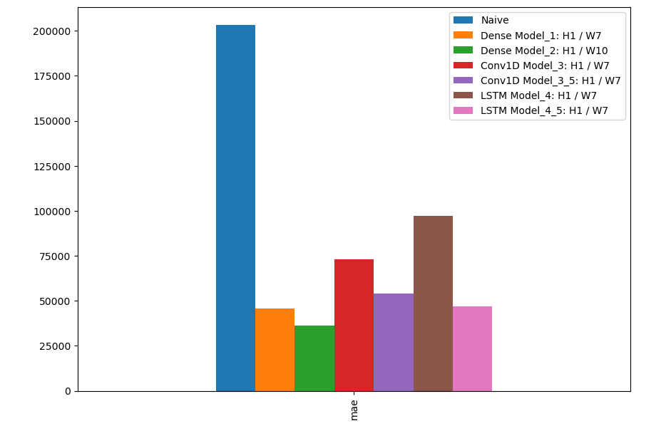
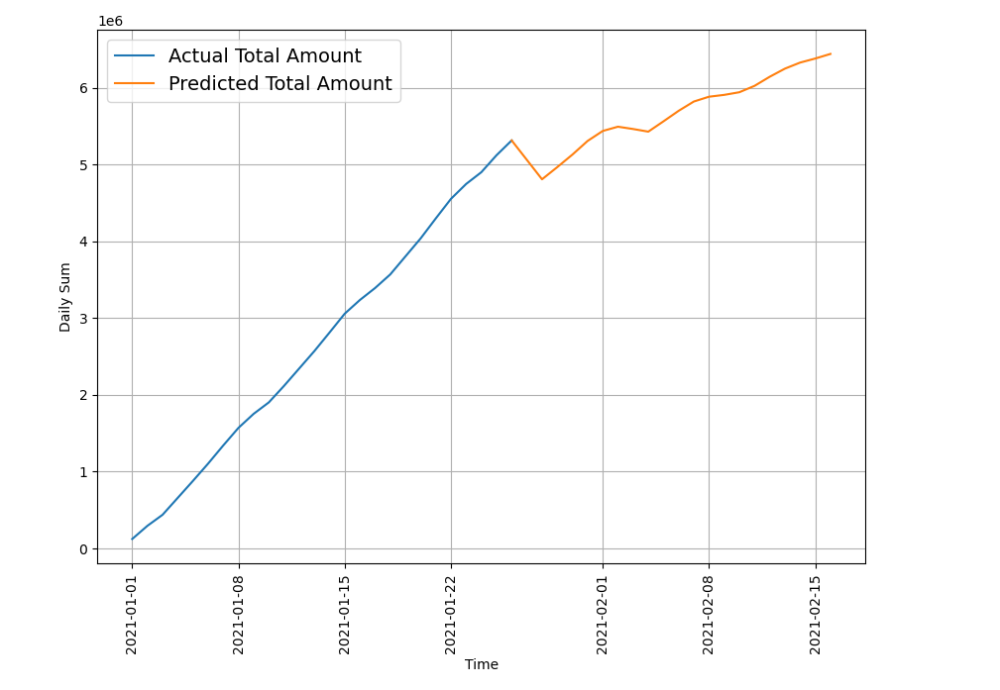
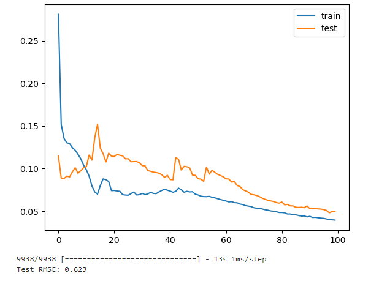
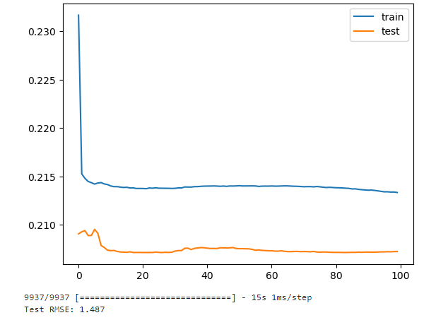
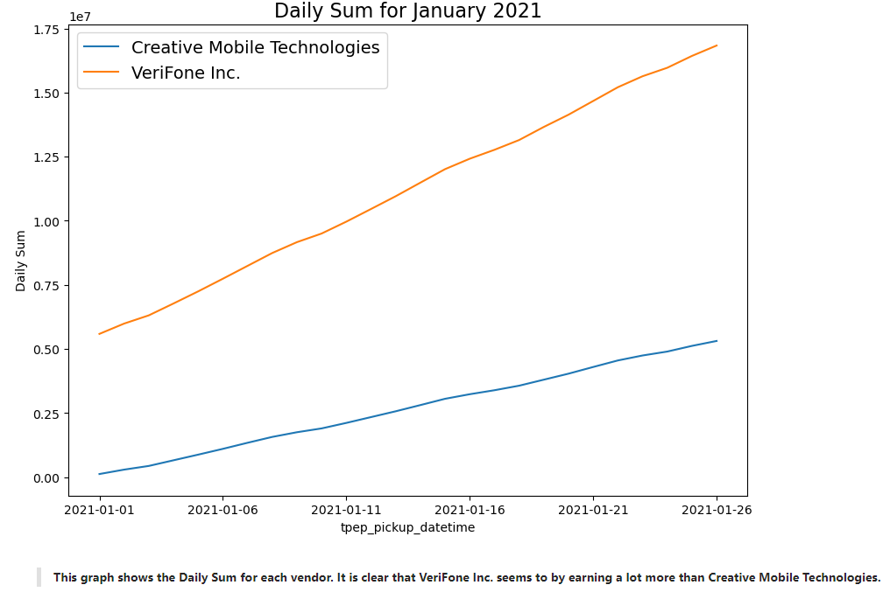
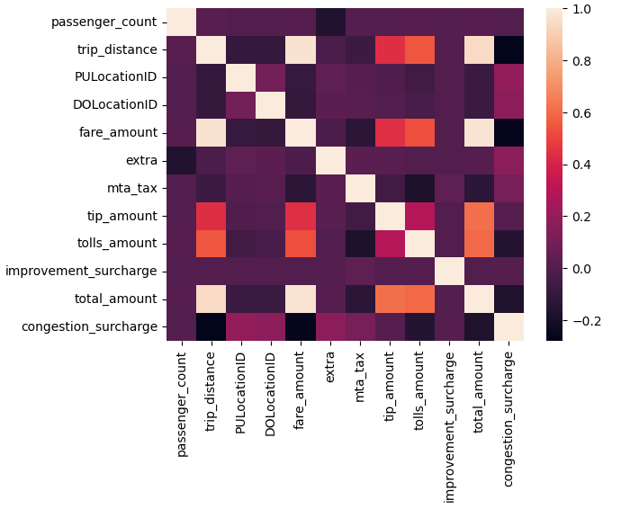
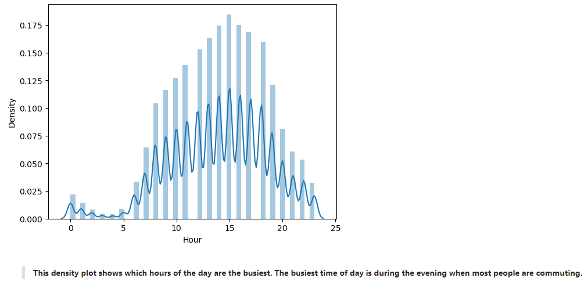
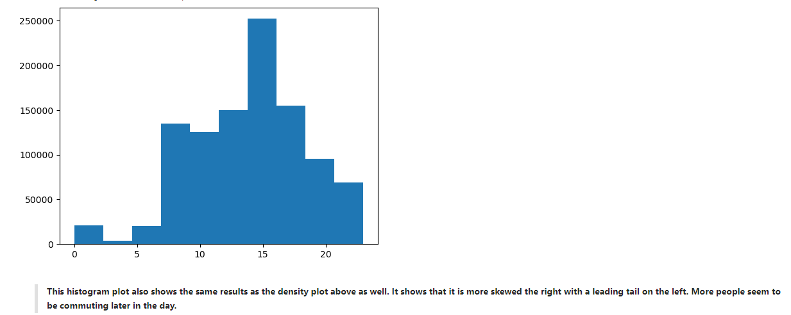
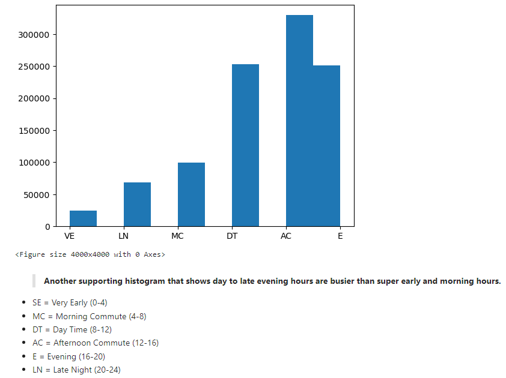

# New York Taxi-Cab: Deep Learning Time Series Prediction Modeling and Business Case Analysis

# Author
- [aaslam-collab](https://github.com/aaslam-collab)

# Table of Contents
- Overview
- Data Source
- Jupyter Notebook - Layout
- Tools
- Quick Summary
- Future Considerations

## 🌄 Overview:
The purpose of this assignment is to understand what the data is telling us from a business/data analysis viewpoint and to construct prediction model to forecast future earnings. 

Starting from the business case, the data was inspected from high to low-level approach. Once we get a understanding of the data of what the data is telling us, we can then start to model to predict future earnings. In this project, rather than using traditional modeling techniques such as using ARIMA or SARIMA models, several deep learning models were used instead. Models such as a basic dense model, Conv1D, and an LSTM neural networks. After comparing the performance of  each model, a simple dense model was used for future predictions as it performed the best. As an additional bonus, a separate multivariate analysis was conducted with and without lag for further comparison and analysis. 

# 🔢 Data Source
[New York City's open TLC Taxi Cab data set](https://www.nyc.gov/site/tlc/about/tlc-trip-record-data.page).

For SQL analysis, I used both Green and Yellow Janurary 2021 data for comparisons purposes. For the model predections, I used the Yellow data to make things simple. 

# 📚 Jupyter Notebook - Layout
- **Inspection, Cleaning, Feature Engineering, and Data Exploration of Data**
  - **High-Level Approach**
  - **Low-Level Approach**
- **Time Series Prediction Modeling**
  - **Models - Naive, Dense, Conv1D, LSTM**
  - **Future Predictions**
  - **Multivariate Analysis - With and Without Lag**
- **Summary of Multivariate Analysis**

# 🛠 Tools
- Jupyter Lab
- Python
- TensorFlow
- Microsoft SQL Server

# 📄 Quick Summary and Key Findings
### **Model Performance Comparison**

> **This graph shows different models compared to each other based on the MAE value. Each model is based on their Horizon and Window Size**
> 
> - **Naive Model performs the worst as its soley predicting on previous data without learning patterns within the dataset. Due to this, it is unable to reliably generalize**
> - **Model_2 seems to outperform all other models** 
> - **Model 4 performs the worst out of the other deep learning models. As mentioned previously, improving Model_3 and Model_4 required an increase in the number of hidden units and layers, i.e. Model_3_5 and Model_4_5. With the addition of hyperparameter tuning, the models performance improved drastically, almost reaching Model_1's performance** 
> - **Additional modeling experiments might improve the results such as using Window_Size of 10 for the Conv1D and LSTM experiments including experiments with different neural networks**

### **Future Predictions**

> **Running the model and graphing its projections indicate that moving into Feburary 2021, the model predicts a steady increase in daily earnings is to be expected.**
> 
> - ❗ **Note:** This uses a regular Dense model as it performed well in previous experiments

### **Multivariate Analysis**

#### **With Lag**

#### **Without Lag**

#### **Summary of Multivariate Analysis**

We can see that model for **`Multivariate Analysis - Without Lag`** outperformed the **`Multivariate Analysis - With Lag`** model.
- **`Multivariate Analysis - Without Lag`**: Test RMSE: 0.623
- **`Multivariate Analysis - With Lag`**: Test RMSE: 1.487

Even though the numbers look great, the actualy graphs do not show that the model is generalizing properly to the data and that the numbers are bit misleading.
- **Without-Lag**: The loss curve shows a lot of stepping where the model is not able to generalize to the data properly and it shows it struggles. Just around epoch 60, it starts to stabilize and it starts to improve. This shows some level of unrepresentative training data for the loss curves.
- **With-Lag**: The loss cruve doesn't show stepping, but the train and test loss curves are far apart with a higher RMSE value. Just like **Without-Lag**, this too shows a bit of unrepresentative training as well. 

### Without-Lag
In the case of unrepresentative testing dataset (or validation dataset), the testing data is not able to provide the necessary information for the model to generalize on unseen data. This could occur if there isn't enough data for testing. The general pattern that is observed in the loss curves is that the training data seems to improve it's loss while the testing (or validation data) data shows noisy improvements or little or no improvements. In our case, we can see the training data seems to improve over time and that the testing data shows noisy improvements. 

**Solution:**
- To imrpove the loss curves, you can either add more observations to the testing (or validation) data or if limited with the number of observations, you can use cross-validation. Since our model is training and testing on a time series dataset, we won't be able to do cross-validation, but we can add more data to improve its loss curves. 

### With-Lag
Unrepresentative training occurs when the training dataset is not able to provide the information needed for the model to understand the problem, as compared to the test (or validation) dataset. Unrepresentative training usually shows that the loss decreases overtime, for both datasets, but there is a large gap between the two curves. The two main reasons why this happens are the following:
- not enough examples in the training dataset as compared to the test (or validation) dataset
- the validation dataset contains a higher variance than the training dataset

**Solution:**
- Normally, you would add more observations, include data augmentation to help increase feature variability in the training data, random sampling (more specifically, stratified sampling), or incorporate cross-validation. The nature of this experiment is based on a time series analysis. It would be difficult to incorporate the aformentioned solutions, except for adding more observations. 

### Next Steps for Multivariate Analysis
- The Multivariate Analysis was conducted **with and without lag**. In both experiments, the loss curves were not optimal and struggled to generalize on unseen data or have trouble learning from the training data. Since the model is learning on time series data, the next step would be to add previous months, or even years, of data to help improve the loss curves so that the model can learning better from the training data and generalize on unseen data. With additional data, it can improve the results for **with and without lag models.**

# Business Case Analysis
### Key Points:
- VeriFone Inc. is an important business partner as they bring in more revenue in comparison to Creative Mobile Technologies

- Correlation Matrix reveals that `total_amount` has a significant correlation with features `trip_distance' and `fare_amount`. Which makes sense because longer distance commute increases the cost of travel

- Majority of the people tend to commute during business hours. However, data does suggests that lots people commute commute slightly before and after business hours, ranging from 6 AM - 11:59 PM. Most of the commuting occurs during DT (8 AM - 12 PM), AC (12 PM - 4 PM), and E (4 PM - 8 PM) commuting hours, as shown in the figures down below:

### Analysis
- With the information provided above, it becomes important to understand the movement of people. This is to ensure that during times of adverse weather conditions, city construction, city planning, and investments into public transportation infrustructure, amongst other conditions, public safety and mobility be a priority to make everyday life easier for citizens. Smart city planning should include business opportunities with contractors to gather data which will enable city planners to ensure new ideas are brought to the table through data and prediction modeling. Being able to predict commute patterns in the future enables city planners and officials to be proactive rather than reactive in their decision making and future planning of projects

# 🔧 Future Considerations
- The experiment only **considered 1 month of data**, whereas, New York's TLC datasets go all the way back to 2009. **Future experiments can consider adding all of 2020's taxi data** so that we can have a more accurate prediction for 2021 Feburary to December
- **Increasing the complexity of the models** and/or using a **N-Beats model** as outlined in this [paper](https://arxiv.org/pdf/1905.10437.pdf)
- Instead of deep learning **experiment with models such  as ARIMA**
- Use **Meta's Prophet Open Source Time series Modeling for Python**
- Another great place would be to look at the **M Competition**. This competition is held by the [International Institute of Forecasters](https://forecasters.org/resources/time-series-data/). Additional resources can be found at the [Monash Time Series Forecasting Repository](https://forecastingdata.org/). Future time series experiments of the taxi cab dataset **should incorporate some of the lessons learned from the M Competition for better results**
